# Description of Charts

Below are detailed descriptions about the charts included in the repository.

# Paired Bar Chart

A paired bar chart displays two related data sets side by side for direct comparison. It's commonly used to compare categories across two groups, such as male vs. female or before vs. after.

## Data

The recommended datasets for this chart are `population-austria.csv` and `co2-emissions.csv`. The first dataset compares the number of men and women in Austria by age group. The second dataset contains the CO2 emissions per continent in 2021 and 2022.

Since a paired bar chart usually visualizes different groups, it is recommended to use different color families for each side.

In RAWGraphs, choose the following data mappings:

First dataset
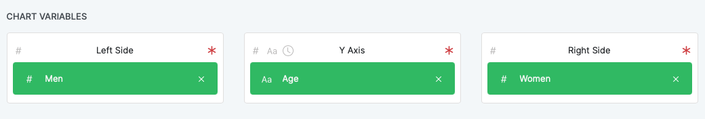

Second dataset
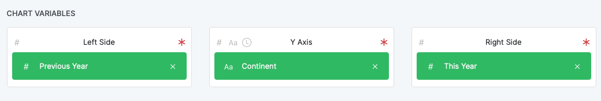

# Bullet Chart

A bullet chart is a linear chart used to display performance data against some target value. It typically shows a single measure (like current performance), along with qualitative ranges (e.g. poor to excellent) and a target marker.

## Data

The first recommended dataset for this chart is `revenues.csv`. This dataset compares companies revenues with their target revenues.

In RAWGraphs, choose the following data mapping:

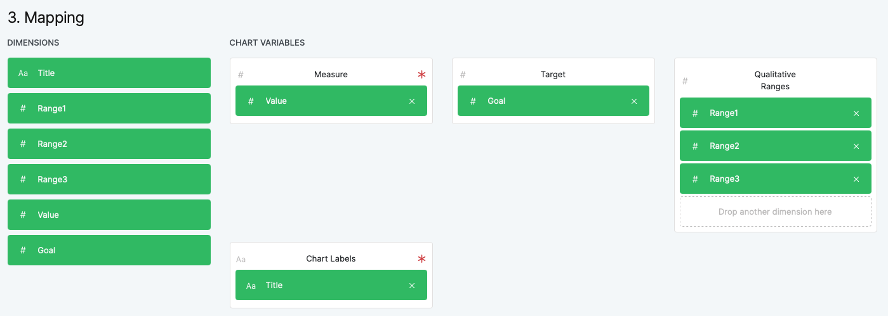

The second recommended dataset is `happiness.csv`. This dataset shows the

# Connected Scatter Plot
A connected scatter plot shows the evolution of a value over time with a connected line. 

## Data

The recommended datasets for this chart are `cereal.csv` and `unemployment-rate.csv`. The first dataset shows the number of customer complaints grouped by issue type. The second dataset contains the unemployment rate in the US from 2015 to 2025.

In RAWGraphs, choose the following data mapping:

First dataset:

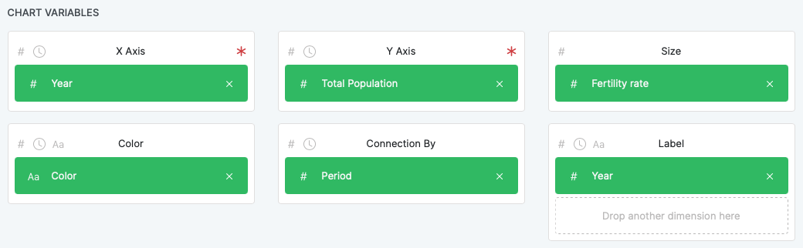

Second dataset:
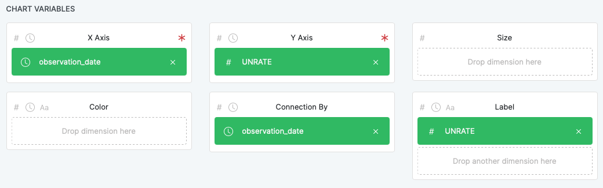

# Pareto Chart

A Pareto chart is a combination of a bar chart and a line graph. The line shows the cumulative percentage.

## Data

The recommended datasets for this chart area `complaints.csv` and `km.csv`. The first dataset shows the number of customer complaints grouped by issue type. The second dataset shows the average kilometers per hour for different transportation methods.

In RAWGraphs, choose the following data mapping:

First dataset:

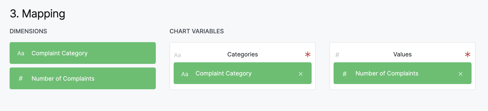

Second dataset:

# Polar Area Chart

A polar area chart displays data similar to a pie chart where each segment represents a category, and the radius of each segment corresponds to its value.

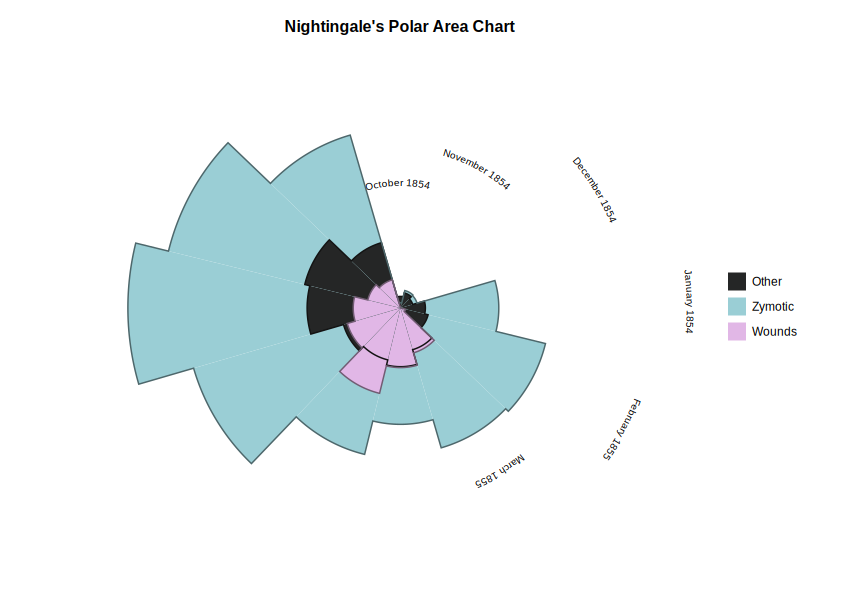

## Data

The recommended datasets for this charts are `nightingale.csv` and `master-studies.csv`. The first datset is Florence Nightingale's original dataset, that shows the causes of mortality in the army in the east from 1854 to 1855. The second dataset shows the number finished studies between 2013 and 2025.

In RAWGraphs, choose the following data mapping:

First dataset:

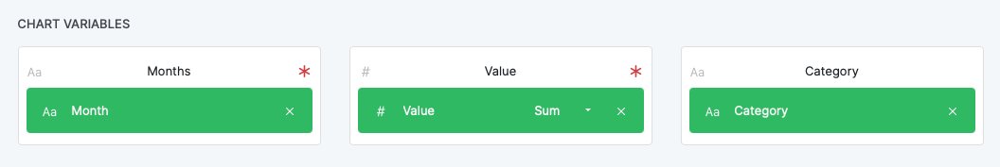

Second dataset:
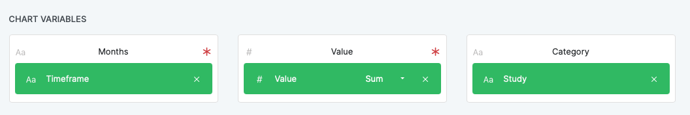

# Similarity Map

A similarity map is a visual representation that places similar items closer together and dissimilar ones farther apart. It helps to reveal patterns, clusters, or relationships in complex datasets, often using methods like PCA or t-SNE.

## Data

The recommended datasets for this chart are `cereals.csv` and `iris.csv`. The first dataset shows how many different nutritions like protein, fat, sodium etc. cereals contain. The second dataset is about different of iris' and their properties like sepal witdh and length.

In RAWGraphs, choose the following data mapping:

First dataset:

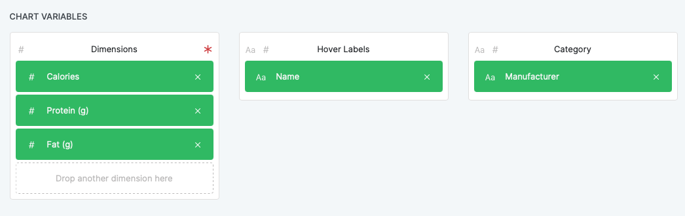

Second dataset:
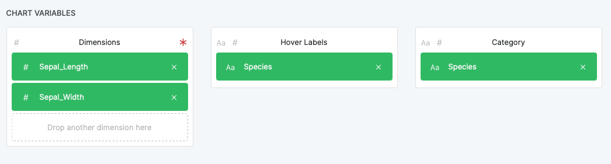

Feel free to swap the dimensions to the ones you are interested in. In the `Customize` section of RAWGraphs under `Dimensionality Reduction` you can choose one of three reduction methods which are PCA, UMAP, t-SNE and FDP.
