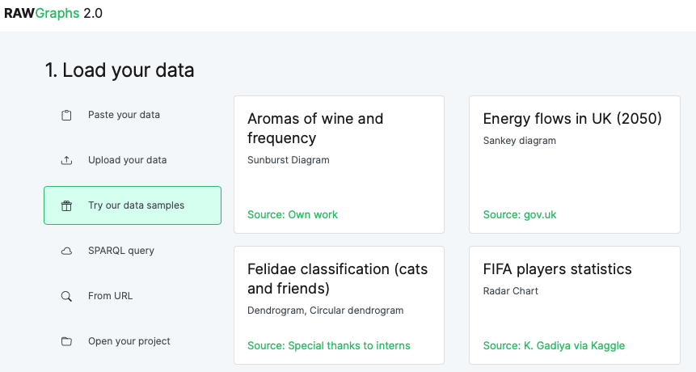
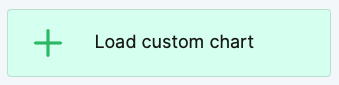
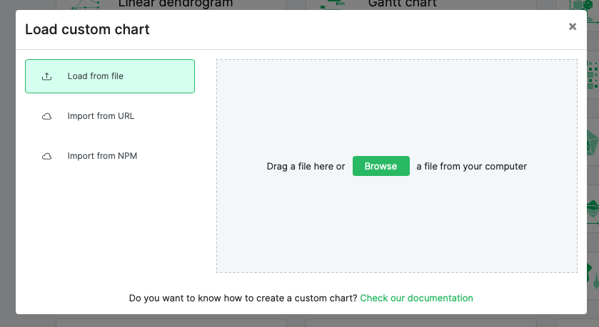

# IVIS - G1 - HCC Custom Charts for RAWGraphs

Vera Tysheva, Bastian Kandlbauer, Laura Pessl

(based on the previous work of Aumüller Thomas, Heider Martin, Ramadan Abdelrahman)

# Getting started

1. Clone the git repository:
   ```
   git clone https://github.com/laurapessl/hcc-custom-charts.git
   ```
2. Go to the repository folder
   ```
   cd hcc-custom-charts
   ```
3. Install the client-side dependencies:
   ```
   yarn install
   ```
   
# Create a Bundle for RAWGraphs

If you are satisfied with your project, you can build the JavaScript bundle to be used in the RAWGraphs interface.

1. Go to the repository:

   📂 yourfolder  
    ├── 📁 `hcc-custom-charts/`  
    └── 📁 `rawgraphs-app/`

   ```
   cd hcc-custom-charts
   ```

2. Build the project
   ```
   yarn build
   ```
3. This will generate a folder named `lib/` in `hcc-custom-charts/`, in which you will find a umd.js file for each of your charts, as well as the hcc-custom-charts-index.umd.js file, which is a bundle of all charts together:

   📂 yourfolder  
    ├── 📁 `hcc-custom-charts/`  
    <span style="color: transparent;">├──</span>└── 📁 `lib/`  
    <span style="color: transparent;">├──├──</span>└── `hcc-custom-charts-index.umd.js`  
    <span style="color: transparent;">├──├──</span>└── `hcc-custom-charts-<yourchart>.umd.js`   
    <span style="color: transparent;">├──├──</span>└── `...`   
    └── 📁 `rawgraphs-app/`

   Those files can now be loaded with RAWGraphs.

# Upload the bundle to RAWGraphs

The following steps can be executed on the local RAWGraphs app, as well as on https://app.rawgraphs.io.

1. Load your your data  
   Either upload your own dataset, or chose a dataset from `Try our data samples`



3. Choose a chart  
   At the end of the section, choose `Load custom chart`



4. Load custom chart  
   Select your `hcc-custom-charts-<yourchart>.umd.js` file.



# Run the project

## Recommended: Run project locally with the RAWGraphs app

### Create Link

1. Go to the repository folder:

   📂 yourfolder  
   └── 📁 `hcc-custom-charts/`

   ```
   cd hcc-custom-charts
   ```

2. Create link:
   ```
   yarn link
   ```

### RawGraphs App

1. Clone the git repository:

   ```
   git clone git@github.com:rawgraphs/rawgraphs-app.git
   ```

2. Go to the repository folder:

   📂 yourfolder  
   ├── 📁 `hcc-custom-charts/`  
   └── 📁 `rawgraphs-app/`

   ```
   cd rawgraphs-app
   ```

3. Install dependencies:
   ```
   yarn install
   ```
4. Add link:
   ```
   yarn link "@rawgraphs/hcc-custom-charts"
   ```
5. Start RAWGraphs
   ```
   yarn run start
   ```

## Sandbox Environment

1. Clone the git repository:
   ```
   git clone https://github.com/laurapessl/hcc-custom-charts.git
   ```
2. Go to the repository folder
   ```
   cd hcc-custom-charts
   ```
3. Run the sandbox environment to test your charts:
   ```
   yarn sandbox
   ```
4. Check out the live preview under:
   ```
   localhost:9000
   ```

---

# Troubleshooting

## Probems with `yarn install`

If you get the error `error @testing-library/dom@10.4.0: The engine "node" is incompatible with this module. Expected version ">=18". Got "16.20.2"` try installing a newer version (>= 18) of node the following:

```
nvm install 22
nvm use 22
```

## Problems with `yarn sandbox`

Commands that may fix some of the Node.js errors when trying to run .

```
yarn add ml-pca umap-js
```

## Problems with `yarn build`

react-scripts: not found

```
yarn install
```

### Changes to run Similarity Map in Sandbox

- added `src/similaritymap`.
- added `src/styles/base.raw.css`.
- added `src/index.html`:
  - export { default as similaritymap } from './similaritymap'
- added `src/tsne.js`.
  - (for later <b>UMAP</b> und <b>PCA</b>)
- added `datasets/fake-multiset.tsv`.
- added `example/configurations/similaritymap-test.js`.
- added `example/configurations/similaritymap-test.js`:
  - import chart from `customcharts/similaritymap`

### What is `.rawgraphs`

JSON-based format that allows users to save and later reload their projects.

- Data
  - The dataset used for the visualization.
- Visualization Type
  - The specific type of chart or graph (e.g., bar chart, scatter plot).
- Mapping
  - The dimensions e.g. which column for x-axis, color, etc.
- Customizations
  - Any custom settings or styles applied to the visualization.

## Tutorial

A small tutorial can be found [here](tutorial/tutorial.md) in the folder `tutorial/tutorial.md`

## Contribute

If you'd like to contribute, follow the RAWGraphs [custom template guide](https://github.com/rawgraphs/custom-rawcharts-template).

## Credits

Supervisor: [@kandrews99](https://github.com/kandrews99).

Original code and template for Similarity Map by [@blindguardian50](https://github.com/blindguardian50) [@steve1711](https://github.com/steve1711), [@TheAlmightySpaceWarrior](https://github.com/TheAlmightySpaceWarrior), [@wizardry8](https://github.com/wizardry8).

Final implementation of Similarity Map and original code for Connected Scatterplot, Polar Area Diagram by [@solidth](https://github.com/solidth), [@hezojez](https://github.com/hezojez) and [@Ramadan877](https://github.com/Ramadan877).

Extensions added to Connected Scatterplot, Similarity Map and finalization of Polar Area Diagram as well as implementation of Bullet and Pareto Chart by [@bkandlbauer](https://github.com/bkandlbauer), [@theplanetarpelican](https://github.com/theplanetarpelican) and [@laurapessl](https://github.com/laurapessl).
